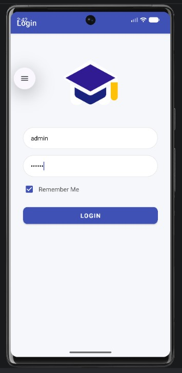
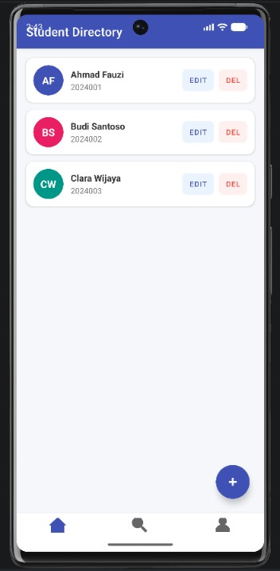
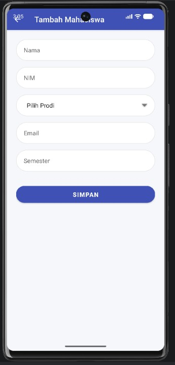
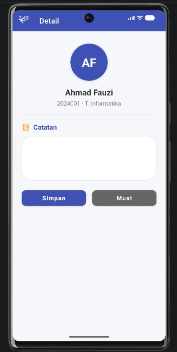
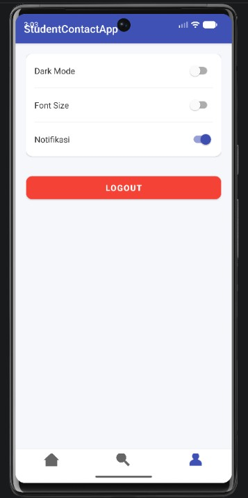
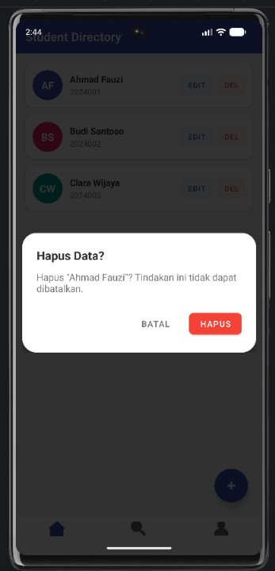
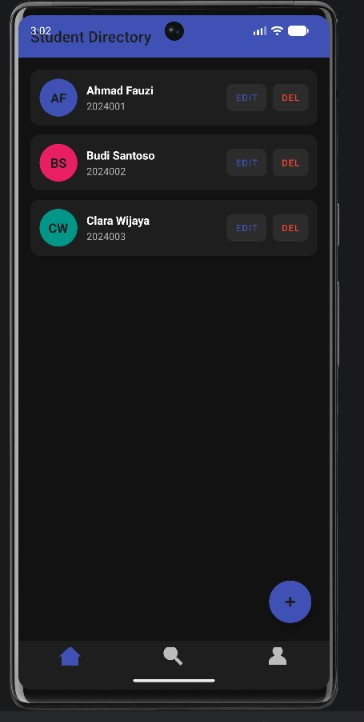
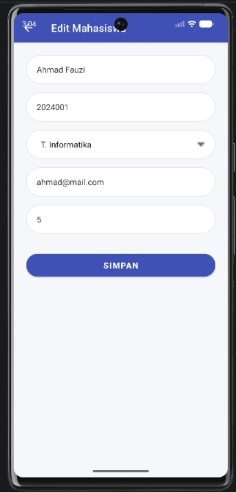

# StudentContactApp

**Nama: Intan Nurgitasari** 

**NIM:F1D0230060**

**Kelas: Pember B** 

# Screenshot Aplikasi

## 1. Login

## 2. Daftar Mahasiswa

## 3. Tambah Data Mahasiswa

## 4. Detail Catatan Mahasiswa 

## 5. Pengaturan (Settings)

## 6. Hapus Data Mahasiswa

## 7. Dark Mode

## 8. Edit Data Mahasiswa

**Deskripsi Singkat Aplikasi**
StudentContactApp adalah aplikasi Android yang digunakan untuk mengelola data mahasiswa. Pada aplikasi ini, pengguna dapat menambahkan, mengubah, menghapus, mencari, dan melihat detail data mahasiswa. Data yang disimpan meliputi nama, NIM, program studi, email, dan semester. Selain itu, aplikasi juga memiliki fitur login dengan Remember Me, pengaturan profil, serta catatan mahasiswa yang disimpan di penyimpanan internal. Tampilan aplikasi dibuat sederhana agar mudah digunakan.

**Metode Penyimpanan yang Digunakan**
Aplikasi ini menggunakan beberapa metode penyimpanan sesuai kebutuhan. SharedPreferences digunakan untuk menyimpan status login, fitur Remember Me, dan pengaturan aplikasi seperti Dark Mode serta Notifikasi. Internal Storage digunakan untuk menyimpan catatan setiap mahasiswa dalam bentuk file teks. Untuk data utama mahasiswa, aplikasi menggunakan Room Database karena lebih mudah digunakan dalam proses CRUD, mendukung pencarian data, dan dapat menyimpan data secara lokal dengan lebih terstruktur.

**Kendala dan Cara Mengatasinya**
Kendala yang dihadapi adalah beberapa kali project mengalami error sehingga aplikasi tidak bisa dijalankan. Penyebabnya itu dari konfigurasi Gradle, dependency, dan juga ada dari beberapa file XML yang belum sesuai ketika melakukan perubahan. kemudian cara mengatasinya itu dengan mengecek kembali konfigurasi project, memperbaiki bagian yang bermasalah, lalu menguji kembali aplikasi hingga semua fitur dapat berjalan dengan baik.
